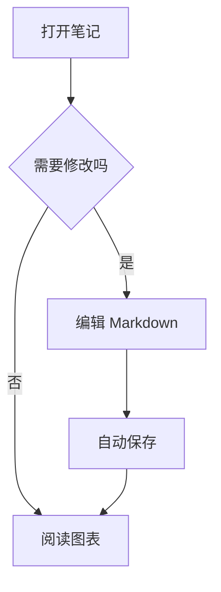

# 流程图

类型：flowchart。点击图表进入源码编辑，移到本段或标题后恢复预览。

```mermaid
flowchart TD
    A[打开笔记] --> B{需要修改吗}
    B -->|是| C[编辑 Markdown]
    C --> D[自动保存]
    B -->|否| E[阅读图表]
    D --> E
```

图后正文：检查滚动后这段文字仍可阅读和编辑。
