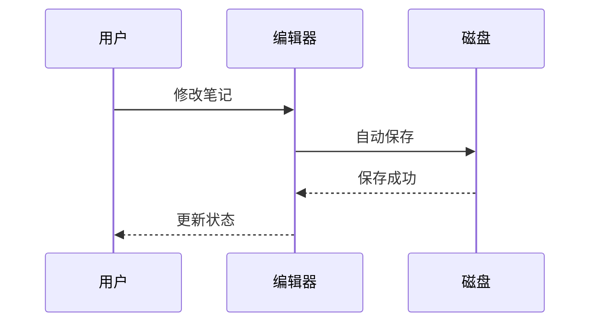

# 时序图

类型：sequenceDiagram。点击图表进入源码编辑，移到本段或标题后恢复预览。

```mermaid
sequenceDiagram
    participant U as 用户
    participant E as 编辑器
    participant D as 磁盘
    U->>E: 修改笔记
    E->>D: 自动保存
    D-->>E: 保存成功
    E-->>U: 更新状态
```

图后正文：检查滚动后这段文字仍可阅读和编辑。
