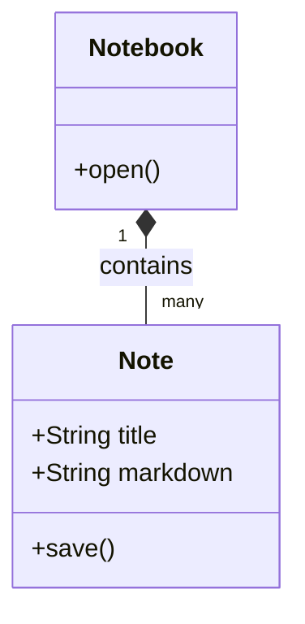

# 类图

类型：classDiagram。点击图表进入源码编辑，移到本段或标题后恢复预览。

```mermaid
classDiagram
    class Note {
        +String title
        +String markdown
        +save()
    }
    class Notebook {
        +open()
    }
    Notebook "1" *-- "many" Note : contains
```

图后正文：检查滚动后这段文字仍可阅读和编辑。
