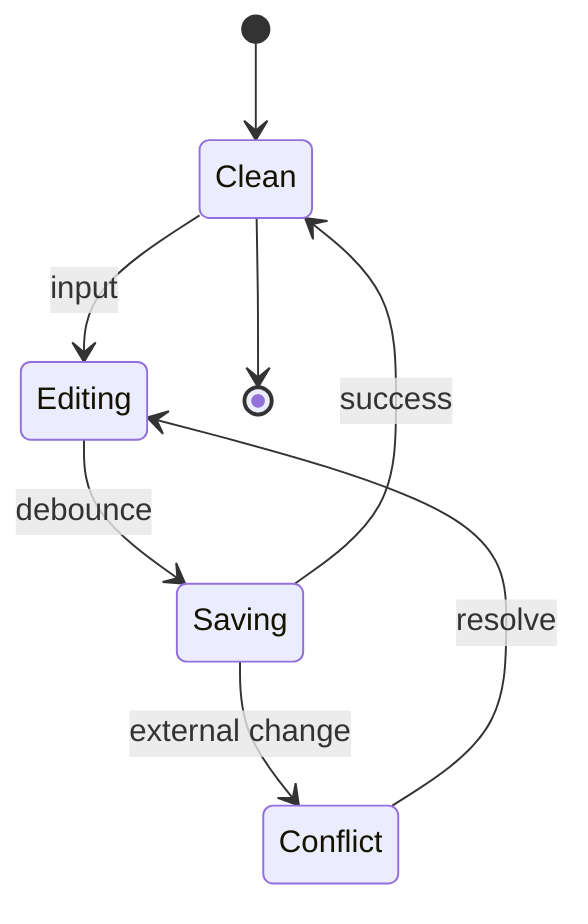

# 状态图

类型：stateDiagram。点击图表进入源码编辑，移到本段或标题后恢复预览。

```mermaid
stateDiagram-v2
    [*] --> Clean
    Clean --> Editing: input
    Editing --> Saving: debounce
    Saving --> Clean: success
    Saving --> Conflict: external change
    Conflict --> Editing: resolve
    Clean --> [*]
```

图后正文：检查滚动后这段文字仍可阅读和编辑。
