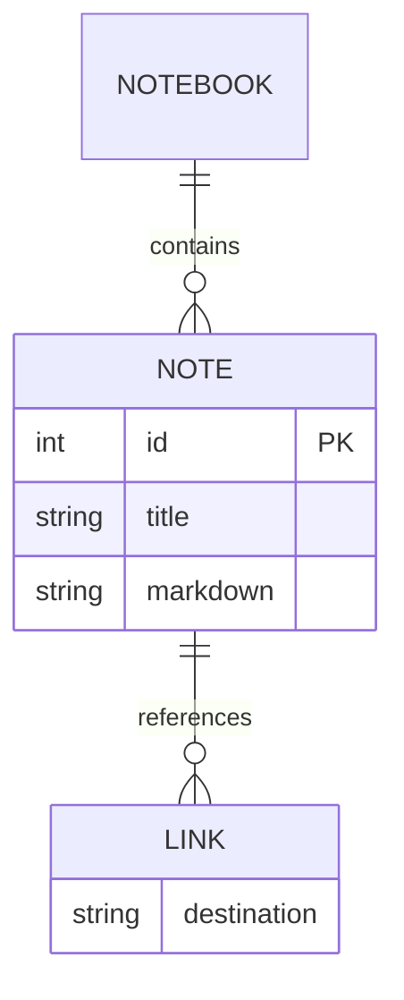

# 实体关系图

类型：erDiagram。点击图表进入源码编辑，移到本段或标题后恢复预览。

```mermaid
erDiagram
    NOTEBOOK ||--o{ NOTE : contains
    NOTE ||--o{ LINK : references
    NOTE {
        int id PK
        string title
        string markdown
    }
    LINK {
        string destination
    }
```

图后正文：检查滚动后这段文字仍可阅读和编辑。
