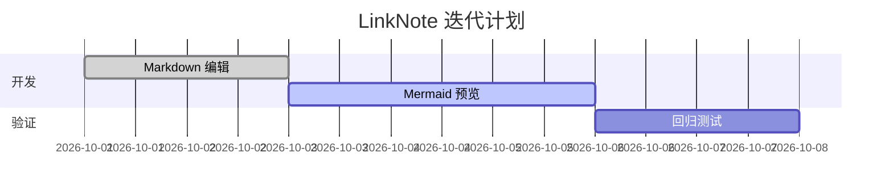

# 甘特图

类型：gantt。点击图表进入源码编辑，移到本段或标题后恢复预览。

```mermaid
gantt
    title LinkNote 迭代计划
    dateFormat YYYY-MM-DD
    section 开发
    Markdown 编辑 :done, edit, 2026-10-01, 2d
    Mermaid 预览 :active, diagram, after edit, 3d
    section 验证
    回归测试 :test, after diagram, 2d
```

图后正文：检查滚动后这段文字仍可阅读和编辑。
