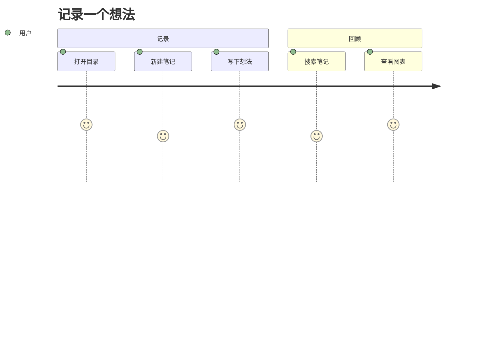

# 用户旅程

类型：journey。点击图表进入源码编辑，移到本段或标题后恢复预览。

```mermaid
journey
    title 记录一个想法
    section 记录
      打开目录: 5: 用户
      新建笔记: 4: 用户
      写下想法: 5: 用户
    section 回顾
      搜索笔记: 4: 用户
      查看图表: 5: 用户
```

图后正文：检查滚动后这段文字仍可阅读和编辑。
