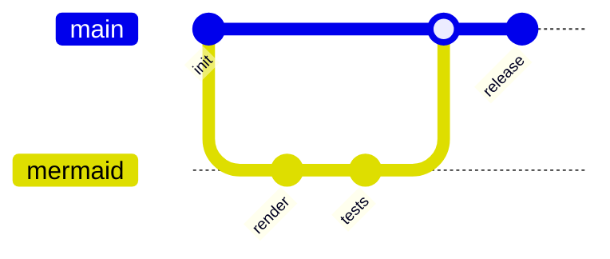

# Git分支图

类型：gitGraph。点击图表进入源码编辑，移到本段或标题后恢复预览。

```mermaid
gitGraph
    commit id: "init"
    branch mermaid
    checkout mermaid
    commit id: "render"
    commit id: "tests"
    checkout main
    merge mermaid
    commit id: "release"
```

图后正文：检查滚动后这段文字仍可阅读和编辑。
