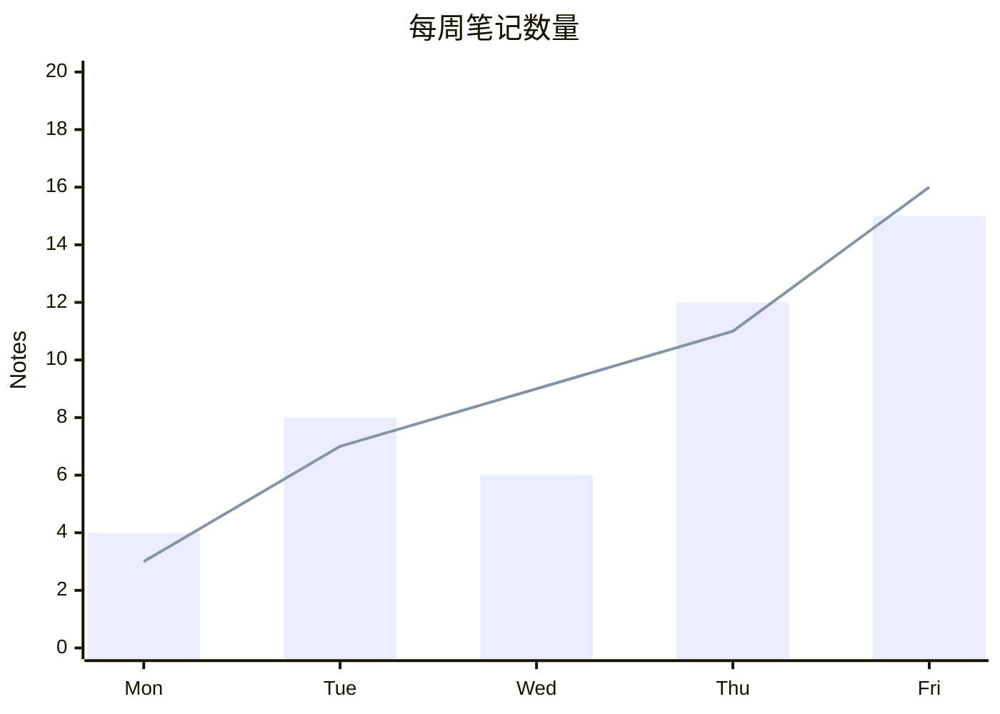

# XY图

类型：xychart。点击图表进入源码编辑，移到本段或标题后恢复预览。

```mermaid
xychart-beta
    title "每周笔记数量"
    x-axis [Mon, Tue, Wed, Thu, Fri]
    y-axis "Notes" 0 --> 20
    bar [4, 8, 6, 12, 15]
    line [3, 7, 9, 11, 16]
```

图后正文：检查滚动后这段文字仍可阅读和编辑。
