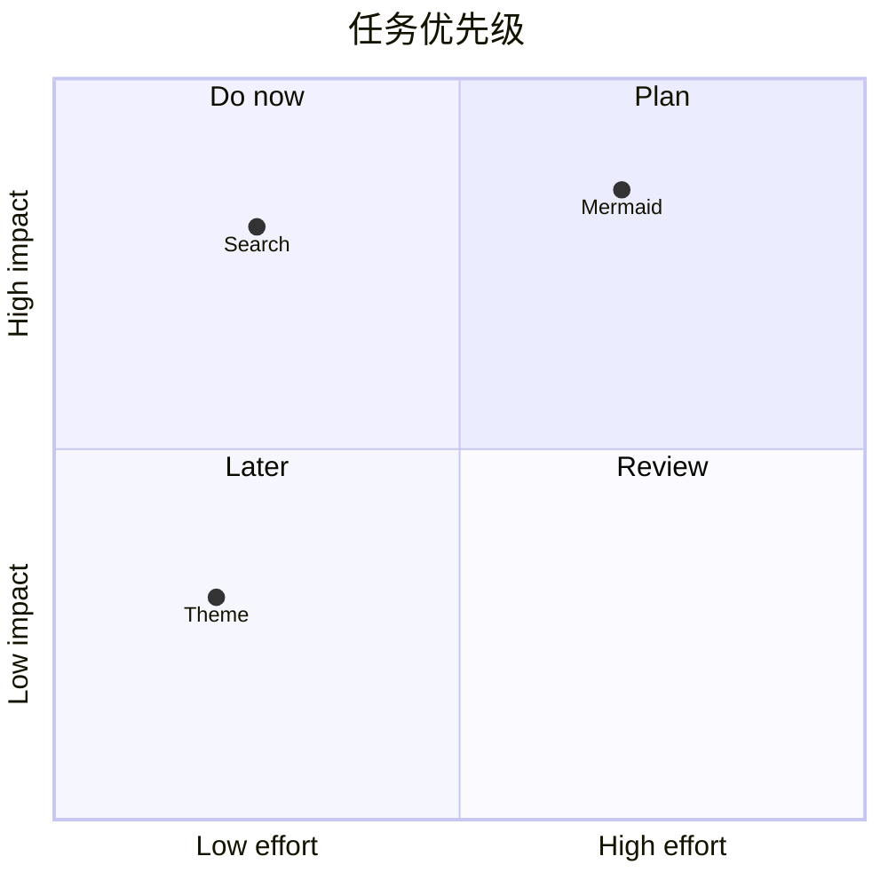

# 象限图

类型：quadrantChart。点击图表进入源码编辑，移到本段或标题后恢复预览。

```mermaid
quadrantChart
    title 任务优先级
    x-axis Low effort --> High effort
    y-axis Low impact --> High impact
    quadrant-1 Plan
    quadrant-2 Do now
    quadrant-3 Later
    quadrant-4 Review
    Search: [0.25, 0.8]
    Mermaid: [0.7, 0.85]
    Theme: [0.2, 0.3]
```

图后正文：检查滚动后这段文字仍可阅读和编辑。
