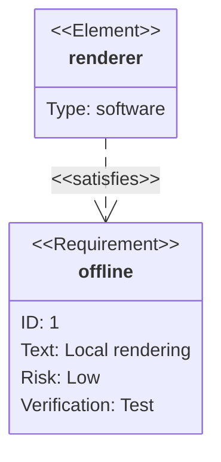

# 需求图

类型：requirementDiagram。点击图表进入源码编辑，移到本段或标题后恢复预览。

```mermaid
requirementDiagram
    requirement offline {
        id: 1
        text: Local rendering
        risk: low
        verifymethod: test
    }
    element renderer {
        type: software
    }
    renderer - satisfies -> offline
```

图后正文：检查滚动后这段文字仍可阅读和编辑。
