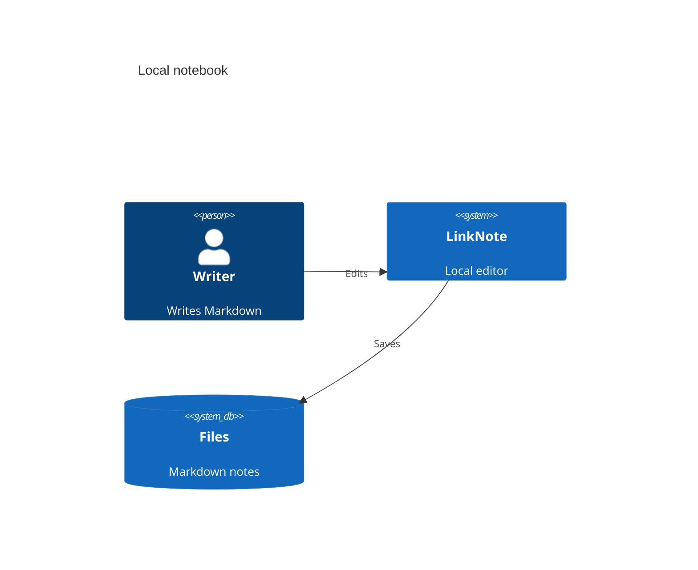

# C4架构图

类型：C4。点击图表进入源码编辑，移到本段或标题后恢复预览。

```mermaid
C4Context
    title Local notebook
    Person(user, "Writer", "Writes Markdown")
    System(note, "LinkNote", "Local editor")
    SystemDb(disk, "Files", "Markdown notes")
    Rel(user, note, "Edits")
    Rel(note, disk, "Saves")
```

图后正文：检查滚动后这段文字仍可阅读和编辑。
