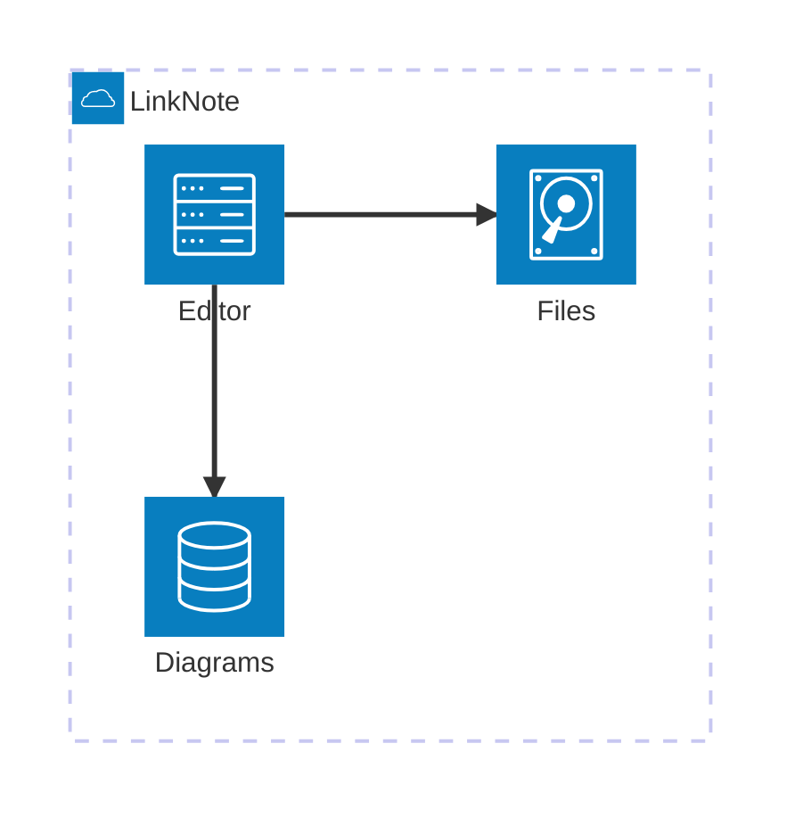

# 架构图

类型：architecture。点击图表进入源码编辑，移到本段或标题后恢复预览。

```mermaid
architecture-beta
    group app(cloud)[LinkNote]
    service editor(server)[Editor] in app
    service files(disk)[Files] in app
    service diagrams(database)[Diagrams] in app
    editor:R --> L:files
    editor:B --> T:diagrams
```

图后正文：检查滚动后这段文字仍可阅读和编辑。
