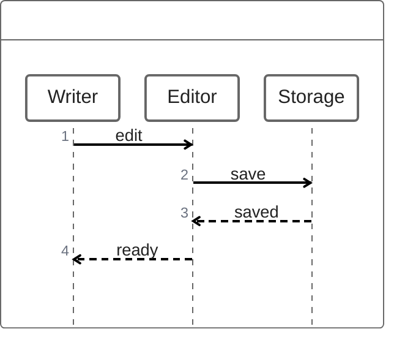

# ZenUML

类型：zenuml。点击图表进入源码编辑，移到本段或标题后恢复预览。

```mermaid
zenuml
    Writer->Editor: edit
    Editor->Storage: save
    Storage-->Editor: saved
    Editor-->Writer: ready
```

图后正文：检查滚动后这段文字仍可阅读和编辑。
